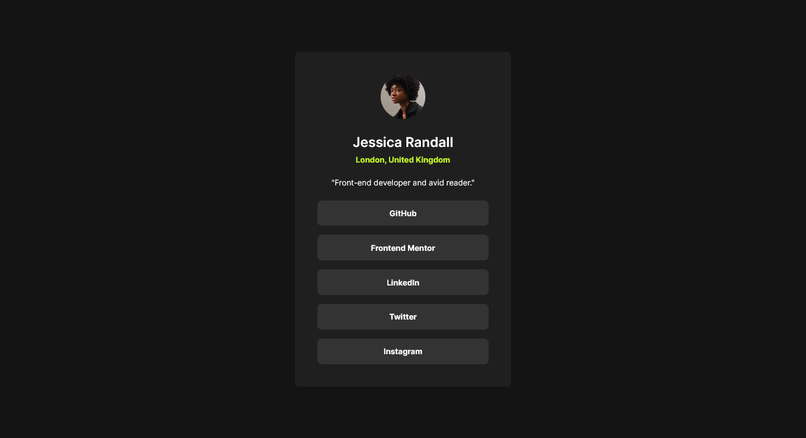
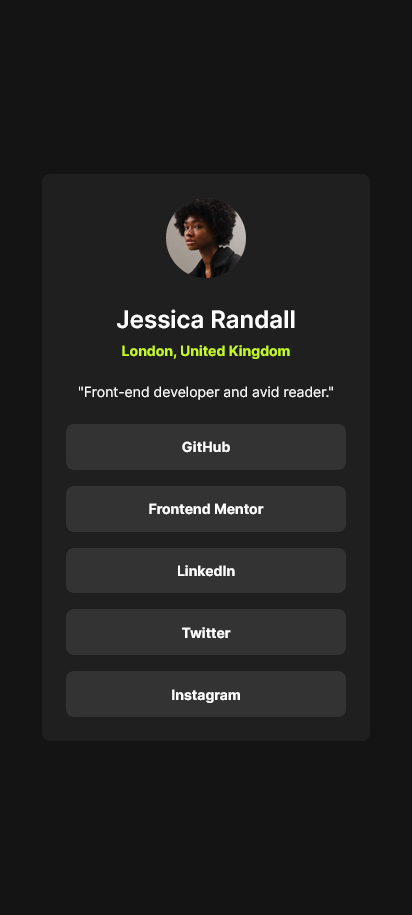

# Frontend Mentor - Social links profile solution

This is a solution to the [Social links profile challenge on Frontend Mentor](https://www.frontendmentor.io/challenges/social-links-profile-UG32l9m6dQ). Frontend Mentor challenges help you improve your coding skills by building realistic projects. 

## Table of contents

- [Overview](#overview)
  - [The challenge](#the-challenge)
  - [Screenshot](#screenshot)
  - [Links](#links)
- [My process](#my-process)
  - [Built with](#built-with)
  - [What I learned](#what-i-learned)
  - [Continued development](#continued-development)
- [Author](#author)

**Note: Delete this note and update the table of contents based on what sections you keep.**

## Overview

### The challenge

Users should be able to:

- See hover and focus states for all interactive elements on the page

### Screenshot

#### Desktop

#### Mobile

### Links

- Solution URL: [Frontend Mentor](https://www.frontendmentor.io/solutions/responsive-social-links-Q1ak4obgiV)
- Live Site URL: [GitHub Pages](https://high-rolls.github.io/social-links-profile-main/)

## My process

### Built with

- Semantic HTML5 markup
- CSS custom properties
- Flexbox
- Mobile-first workflow

### What I learned

I've learned how to use the Screen Ruler application in Windows PowerToys. That was very useful to quickly check the sizes and spacings of elements.

I'm also using `min-height: 100dvh` in the **body** element. Hopefully that fixes some mobile browser quirks, I've yet to test it.

### Continued development

I want to learn how to simplify the process of writing styles. I was thinking of using Tailwind for this one, but decided to keep it pure.

## Author

- Frontend Mentor - [@high-rolls](https://www.frontendmentor.io/profile/high-rolls)
